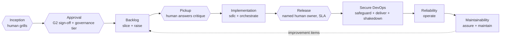

# rahulnakmol/skills

Growth redefined by human judgment at the gates and trusted agents running everything between them — executable across five tools.

## The thesis

Growth is being redefined: value no longer sits in the middle of the skill stack, it concentrates at the two ends — human judgment holding the gates, and agents trusted to run everything between them. Those gates are named and enforced here, not implied: inception (the grill loop a human drives), approval (a signed PRD with a recorded governance tier), pickup (an agent critiques and stops before it implements), and release (a named human owner with an SLA, never a silent auto-approval). Between the gates, AI commoditises the middle of the stack — routine execution and information access are the new baseline, not the differentiator — so this repo invests where the differentiation actually lives: encoded judgment (grill loops, gates, contracts, rubrics) at one end, and trustworthy execution (verifier separation, provider policy enforced in CI, an honestly-automated model registry) at the other. This is that operating model, built to run identically across Claude Code, OpenCode, Codex, Cursor, and GitHub Copilot.

## The operating model



Four human gates (hexagons) frame every journey from an idea to a running, maintained system; agents (rectangles) do the work between them, single writer per checkout, external verifier wherever the output feeds a consequential decision. `orchestrate` decides loop vs graph vs hybrid per `RUBRIC.md`, resolves a model per node via `model-routing`, and — for any high-consequence write — inserts a `human` node with a named owner and an SLA rather than a bare stop condition.

## Choose your altitude

### For leaders — CIO · CDAIO · CTO

This changes what you can say with a straight face about your AI-run delivery: every consequential decision has a named human owner and an SLA, not a vague "human in the loop." Every agent action traces to an approved PRD, a recorded governance tier, and an audit trail — not a chat log someone hopes to reconstruct later. Model choice is a governed, evidence-backed registry enforced in CI, not whichever model a developer happened to have configured. Start at [wiki/Architecture-Role-Journey.md](wiki/Architecture-Role-Journey.md) for the full inception-to-maintenance map, and [skills/developer/responsible-ai-governance](skills/developer/responsible-ai-governance/SKILL.md) for the regulated-industry overlay.

### For architects and engineering managers

The doctrine underneath the gates: route on verifiability, not difficulty ([wiki/Architecture-Loop-vs-Graph.md](wiki/Architecture-Loop-vs-Graph.md)), assign a model per node rather than per project, keep a single writer per checkout with an external verifier wherever contamination risk exists, and delegate through a work-item contract precise enough that a cold pickup — human or agent — can act on it correctly ([wiki/Architecture-Agentic-Pods.md](wiki/Architecture-Agentic-Pods.md)). `orchestrate`'s `RUBRIC.md` carries the evidence this rests on, not just the opinion.

### For developers

Sixty seconds to first use:

```bash
npx skills@latest add rahulnakmol/skills
./scripts/install-adapters.sh
```

Then: `/impact` to turn a raw idea into a graded PRD, `/sdlc` to run a gated build against it, `/shakedown <PR#>` to get any pull request an isolated, agent-reviewed build-test-execute pass before merge. Full per-tool setup at [wiki/Installation.md](wiki/Installation.md).

## Install

```bash
npx skills@latest add rahulnakmol/skills
./scripts/install-adapters.sh
```

Adapters are idempotent; use `./scripts/install-adapters.sh --dry-run` to preview.

## Skills index

| Skill | Group | Invocation | Purpose |
|-------|-------|------------|---------|
| [orchestrate](skills/developer/orchestrate/SKILL.md) | developer | model | Choose loop/graph/hybrid execution, assign a model per node, map to harness adapters |
| [model-routing](skills/developer/model-routing/SKILL.md) | developer | model | Resolve the tier and role assignment for a task node from the canonical registry |
| [update-models](skills/developer/update-models/SKILL.md) | developer | user | Research provider catalogs and propose an evidence-backed registry update |
| [impact](skills/developer/impact/SKILL.md) | developer | user | Idea-to-PRD pipeline: grill loop, value probing, governance-tier recording, backlog handoff |
| [recon](skills/developer/recon/SKILL.md) | developer | model | Brownfield codebase brief via signal-first archetype triage, read-only |
| [slice](skills/developer/slice/SKILL.md) | developer | model | Decompose a signed PRD into epics, features, stories, and operability items |
| [raise](skills/developer/raise/SKILL.md) | developer | model | Publish sliced backlog to GitHub or Linear with pickup-protocol labels |
| [sdlc](skills/developer/sdlc/SKILL.md) | developer | user | Full gated SDLC loop — SPEC-TS ledger, human gates, verifier challenge |
| [architect](skills/developer/architect/SKILL.md) | developer | mixed | Cross-cutting technical design and ADRs at the design gate |
| [safeguard](skills/developer/safeguard/SKILL.md) | developer | mixed | Security assessment and hardening at the secure-DevOps gate |
| [deliver](skills/developer/deliver/SKILL.md) | developer | mixed | CI/CD, supply chain, and release readiness |
| [assure](skills/developer/assure/SKILL.md) | developer | mixed | Quality and maintainability assurance |
| [operate](skills/developer/operate/SKILL.md) | developer | mixed | SLOs, instrumentation, and incident readiness |
| [maintain](skills/developer/maintain/SKILL.md) | developer | mixed | Patch cadence and technical-debt burn-down |
| [shakedown](skills/developer/shakedown/SKILL.md) | developer | user | Sandbox build, test, and agent-reviewed pass on any pull request before merge |
| [ask-fde](skills/developer/ask-fde/SKILL.md) | developer | user | Router mapping intent to the correct developer or branding skill |
| [responsible-ai-governance](skills/developer/responsible-ai-governance/SKILL.md) | developer | overlay | Regulated-industry and responsible-AI governance applied on top of the stack rules |
| [press](skills/branding/press/SKILL.md) | branding | user | Render a signed-off PRD to a branded PDF for stakeholders |

Writing and productivity are charter-only in this release — see [skills/writing/README.md](skills/writing/README.md) and [skills/productivity/README.md](skills/productivity/README.md).

## Validation

```bash
node scripts/validate.mjs
node scripts/run-tests.mjs
```

## License

Apache-2.0 — see [LICENSE](LICENSE) and [NOTICE](NOTICE).
