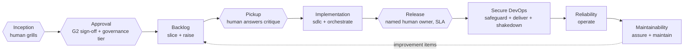

# rahulnakmol/skills

A model for pairing human judgment with trusted AI agents, built as a set of skills that run the same way across five different tools.

## The thesis

Software delivery is being redefined by where value now concentrates: at the two ends of the process, not the middle. Human judgment holds the gates. Trusted agents do the work in between. This repository names those gates and enforces each one in code, rather than leaving them as an assumption. Inception is a grill loop a human drives. Approval is a signed PRD with a recorded governance tier. Pickup requires an agent to critique a work item and stop before it implements anything. Release requires a named human owner with a service-level agreement, never a silent auto-approval. Between the gates, artificial intelligence has made routine execution and information retrieval a baseline capability rather than a source of advantage. This repository invests where the advantage still lives: encoded judgment at one end — grill loops, gates, contracts, and routing rules — and verified, trustworthy execution at the other — a separate verifier for consequential work, a provider policy enforced in continuous integration, and a model registry kept current by an honest, disclosed process. What follows is that operating model, built to run identically across Claude Code, OpenCode, Codex, Cursor, and GitHub Copilot.

## The operating model



The diagram shows four human gates, drawn as hexagons, framing every journey from an idea to a system in production. Agents, drawn as rectangles, do the work between the gates. Each agent step has a single writer and, wherever the output feeds a consequential decision, a separate verifier. The `orchestrate` skill decides whether a task should run as a loop, a graph, or a hybrid of the two, following the rules in `RUBRIC.md`. It resolves a model for each step through `model-routing`, and for any high-consequence write, it inserts a `human` node with a named owner and a service-level agreement rather than a plain stop condition.

## Choose your altitude

### For leaders — CIO · CDAIO · CTO

This model gives a concrete answer to a question that is often left vague: who is accountable when an AI agent acts. Every consequential decision has a named human owner and a service-level agreement, not an unspecified "human in the loop." Every agent action traces back to an approved PRD, a recorded governance tier, and an audit trail, rather than a chat transcript someone might reconstruct after the fact. Model selection follows a registry that is reviewed on a schedule and checked in continuous integration, rather than left to whichever model an individual developer happens to have configured. For the full path from an idea to a maintained system, see [wiki/Architecture-Role-Journey.md](wiki/Architecture-Role-Journey.md). For the regulated-industry overlay, see [skills/developer/responsible-ai-governance](skills/developer/responsible-ai-governance/SKILL.md).

### For architects and engineering managers

The routing rule underneath the gates is simple to state and consistently applied: route on whether an outcome can be verified, not on how difficult a task appears. See [wiki/Architecture-Loop-vs-Graph.md](wiki/Architecture-Loop-vs-Graph.md) for the full rule. A model is assigned per task, not per project. A single writer holds each checkout, with a separate verifier wherever one agent grading its own work would be a conflict of interest. Delegation happens through a work-item contract precise enough that anyone picking it up cold — a person or an agent — can act on it correctly; see [wiki/Architecture-Agentic-Pods.md](wiki/Architecture-Agentic-Pods.md). The reasoning behind these choices, including the evidence it rests on, is in `orchestrate`'s `RUBRIC.md`.

### For developers

To install the skills and start using them:

```bash
npx skills@latest add rahulnakmol/skills
./scripts/install-adapters.sh
```

From there: run `/impact` to turn a raw idea into a PRD that has been through the grill loop, run `/sdlc` to carry out a gated build against it, and run `/shakedown <PR#>` to have any pull request built, tested, and reviewed by an agent in an isolated sandbox before merge. Full setup instructions for each tool are at [wiki/Installation.md](wiki/Installation.md).

## Install

```bash
npx skills@latest add rahulnakmol/skills
./scripts/install-adapters.sh
```

Adapters are idempotent; use `./scripts/install-adapters.sh --dry-run` to preview.

## Skills index

| Skill | Group | Invocation | Purpose |
|-------|-------|------------|---------|
| [orchestrate](skills/developer/orchestrate/SKILL.md) | developer | model | Choose loop/graph/hybrid execution, assign a model per node, map to harness adapters |
| [model-routing](skills/developer/model-routing/SKILL.md) | developer | model | Resolve the tier and role assignment for a task node from the canonical registry |
| [update-models](skills/developer/update-models/SKILL.md) | developer | user | Research provider catalogs and propose an evidence-backed registry update |
| [impact](skills/developer/impact/SKILL.md) | developer | user | Idea-to-PRD pipeline: grill loop, value probing, governance-tier recording, backlog handoff |
| [recon](skills/developer/recon/SKILL.md) | developer | model | Brownfield codebase brief via signal-first archetype triage, read-only |
| [slice](skills/developer/slice/SKILL.md) | developer | model | Decompose a signed PRD into epics, features, stories, and operability items |
| [raise](skills/developer/raise/SKILL.md) | developer | model | Publish sliced backlog to GitHub or Linear with pickup-protocol labels |
| [sdlc](skills/developer/sdlc/SKILL.md) | developer | user | Full gated SDLC loop — SPEC-TS ledger, human gates, verifier challenge |
| [architect](skills/developer/architect/SKILL.md) | developer | mixed | Cross-cutting technical design and ADRs at the design gate |
| [safeguard](skills/developer/safeguard/SKILL.md) | developer | mixed | Security assessment and hardening at the secure-DevOps gate |
| [deliver](skills/developer/deliver/SKILL.md) | developer | mixed | CI/CD, supply chain, and release readiness |
| [assure](skills/developer/assure/SKILL.md) | developer | mixed | Quality and maintainability assurance |
| [operate](skills/developer/operate/SKILL.md) | developer | mixed | SLOs, instrumentation, and incident readiness |
| [maintain](skills/developer/maintain/SKILL.md) | developer | mixed | Patch cadence and technical-debt burn-down |
| [shakedown](skills/developer/shakedown/SKILL.md) | developer | user | Sandbox build, test, and agent-reviewed pass on any pull request before merge |
| [ask-fde](skills/developer/ask-fde/SKILL.md) | developer | user | Router mapping intent to the correct developer or branding skill |
| [responsible-ai-governance](skills/developer/responsible-ai-governance/SKILL.md) | developer | overlay | Regulated-industry and responsible-AI governance applied on top of the stack rules |
| [press](skills/branding/press/SKILL.md) | branding | user | Render a signed-off PRD to a branded PDF for stakeholders |

Writing and productivity are charter-only in this release — see [skills/writing/README.md](skills/writing/README.md) and [skills/productivity/README.md](skills/productivity/README.md).

## Validation

```bash
node scripts/validate.mjs
node scripts/run-tests.mjs
```

## License

Apache-2.0 — see [LICENSE](LICENSE) and [NOTICE](NOTICE).
