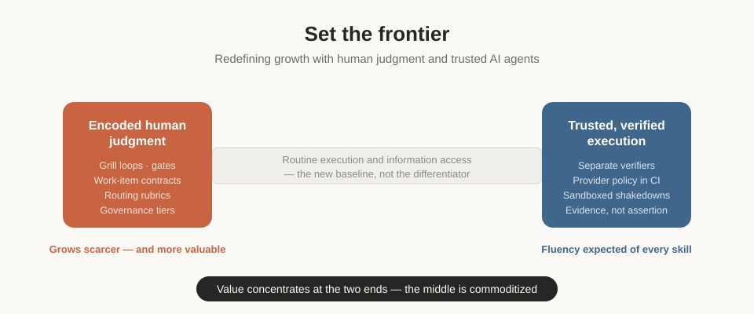
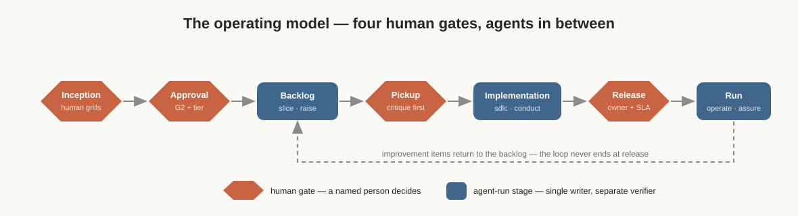
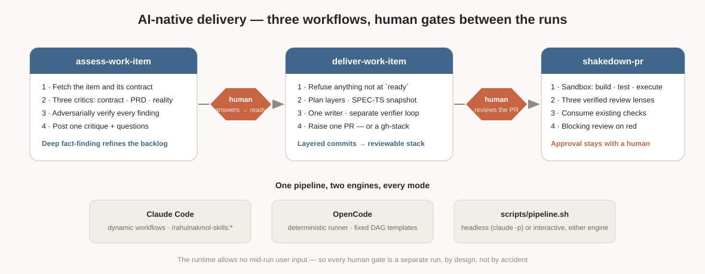
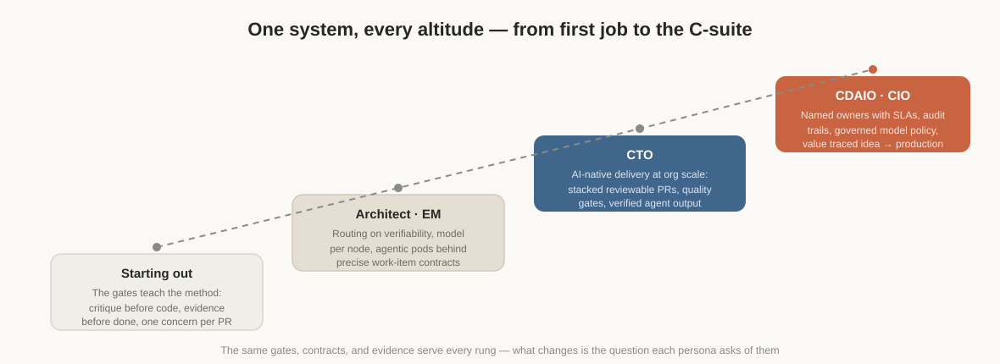
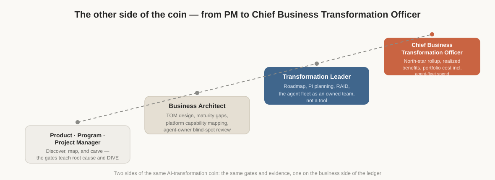

# tqnonline/skills

This is the skills repository of The Quentin (tqnonline): a curated, growing bundle of the AI-native skills we use across our work — authored once, running the same way in Claude Code, OpenCode, Codex, Cursor, and GitHub Copilot. We are curating and building AI-native skills that deliver business value through trusted agents with human judgment — driving growth in personal, professional, and sustainable accomplishments. Software delivery is where we started, because it is where we could prove the method; it is one group among five, not the repository's identity.

## The thesis

Every skill here, whatever its group, carries one philosophy: **Set the frontier: redefining growth with human judgment and trusted AI agents**. Knowledge work is being redefined by where value now concentrates — at the two ends of any process, not the middle. Human judgment holds the gates; trusted agents do the work in between; and routine execution, which artificial intelligence has made a baseline capability, stops being the differentiator. A branding skill applies this the same way a delivery skill does: the agent drafts and renders, a person owns the message and signs the result. This repository invests where the advantage still lives — encoded judgment at one end (grill loops, gates, contracts, routing rules) and verified, trustworthy execution at the other (separate verifiers for consequential work, a provider policy enforced in continuous integration, a model registry kept current by an honest, disclosed research process).



## Skill groups

Five groups, each a bounded area of work rather than a technology layer. We have just started: the first two groups are fully built, one has its first skill, and two carry charters for what comes next.

| Group | What it is | Status |
|-------|------------|--------|
| **Developer — the AI-native SDLC** | The software delivery lifecycle rebuilt for humans plus trusted agents: inception, backlog, design, implementation, secure DevOps, reliability, and maintenance — 17 skills. The group directory is planned to be renamed `ai-native-sdlc` to say what it is. | Shipping |
| **PM — the AI-native transformation practice** | The business side of the same AI-native transformation coin: discovery, TOM design, epic and PRD authoring, business cases grounded in cost including the agent fleet's own, roadmapping, RAID, benefits realization against a north star, and 4Ps leadership reporting — 15 skills. | Shipping |
| **Branding** | Company or personal identity applied to everything an agent produces: tone of voice, color and palette, storytelling. Today: `press`, which turns a signed PRD into a business-ready document and presentation — the first of the storytelling skills. | First skill shipping |
| **Writing** | Skills that make writing better — editorial review, documentation quality, style discipline — in the same explainer voice this repository holds itself to. | Charter — planned |
| **Productivity** | Delightful automations: the personal and team workflows worth never doing by hand again. | Charter — planned |

## The operating model

What follows walks the first fully built group — the AI-native SDLC — in depth; it is the worked example of the thesis, and the pattern the other groups will follow. Its skills implement one journey, from a raw idea to a system running in production, framed by four human gates. Everything between the gates is agent-run: a single writer per checkout, a separate verifier wherever the output feeds a consequential decision.



The `orchestrate` skill decides whether a task runs as a loop, a graph, or a hybrid, following the evidence-backed rules in its `RUBRIC.md` — routing on whether an outcome can be verified, never on how difficult it appears. It resolves a model for each step through `model-routing`, and for any high-consequence write it inserts a `human` node with a named owner and a service-level agreement, not a plain stop condition.

## AI-native delivery: agentic pods and dynamic workflows

Delivery itself runs as three orchestrated stages, built on Claude Code's dynamic-workflow runtime with full parity on OpenCode's deterministic runner. Each stage applies the same discipline the inception grill applies to ideas: deep, fact-finding introspection before action, at every step. The assessment stage interrogates a work item from three independent perspectives — contract completeness, alignment with the signed PRD, and the reality of the codebase — verifies every finding adversarially, and posts what it learned back to the item's thread. Those answers refine the work item where it lives: in the backlog. Nothing is implemented until a human reads the critique and moves the item to `ready`.



A change too large to hold in a reviewer's head never ships as one giant pull request. The delivery workflow plans in layers, commits per layer, and raises a dependency-ordered stack of single-concern pull requests with the `gh stack` tooling — reviewed bottom-up, merged base-to-tip. The shakedown then evaluates each layer against its own stack base, consuming the checks the repository already runs (including GitHub Code Quality on its separate Actions path) rather than repeating them. The full doctrine lives in [STACKING.md](skills/developer/deliver/STACKING.md) and [REPO-SETUP.md](skills/developer/deliver/REPO-SETUP.md) — the readiness checklist these skills follow, or set up, in every repository they work on.

This is a research-driven system, and it evolves with the field. The routing rules cite the findings they rest on. The model registry is curated against live provider catalogs on a disclosed schedule, with every change arriving as a reviewable pull request. Structural decisions are recorded as architecture decision records, and a deterministic test harness — 100 checks and growing — keeps the documentation, the policies, and the workflows honest as the practices they encode keep moving.

## Choose your altitude

The same gates, contracts, and evidence serve every rung of a career; what changes is the question each persona asks of them.



### For leaders — CIO · CDAIO · CTO

This model gives a concrete answer to a question that is often left vague: who is accountable when an AI agent acts. Every consequential decision has a named human owner and a service-level agreement, not an unspecified "human in the loop." Every agent action traces back to an approved PRD, a recorded governance tier, and an audit trail, rather than a chat transcript someone might reconstruct after the fact. Model selection follows a registry that is reviewed on a schedule and checked in continuous integration. For a CTO, the delivery pipeline is what AI-native throughput looks like without giving up review quality: stacked, reviewable pull requests and a sandboxed shakedown on every one. For a CDAIO or CIO, the governance overlay turns responsible-AI frameworks into work items with tests. Start at [wiki/Architecture-Role-Journey.md](wiki/Architecture-Role-Journey.md) and [skills/developer/responsible-ai-governance](skills/developer/responsible-ai-governance/SKILL.md).

### For architects and engineering managers

The routing rule underneath the gates is simple to state and consistently applied: route on whether an outcome can be verified, not on how difficult a task appears. See [wiki/Architecture-Loop-vs-Graph.md](wiki/Architecture-Loop-vs-Graph.md) for the full rule. A model is assigned per task, not per project. A single writer holds each checkout, with a separate verifier wherever one agent grading its own work would be a conflict of interest. Delegation happens through a work-item contract precise enough that anyone picking it up cold — a person or an agent — can act on it correctly; see [wiki/Architecture-Agentic-Pods.md](wiki/Architecture-Agentic-Pods.md).

### For developers

To install the skills and start using them:

```bash
npx skills@latest add tqnonline/skills
./scripts/install-adapters.sh
```

From there: run `/impact` to turn a raw idea into a PRD that has been through the grill loop, run `/sdlc` to carry out a gated build against it, and run `/shakedown <PR#>` to have any pull request built, tested, and reviewed by an agent in an isolated sandbox before merge. `scripts/pipeline.sh` drives the full assess-deliver-shakedown pipeline on either engine. Per-tool setup for Claude Code, OpenCode, Codex, Cursor, and GitHub Copilot is at [wiki/Tool-Guidance.md](wiki/Tool-Guidance.md) and [wiki/Installation.md](wiki/Installation.md).

### Starting out

If you are early in your career, this system is built to grow your judgment, not to exercise it for you. The gates do not hand you answers; they hand you the questions experienced engineers have learned to ask — what evidence says this is done, what single concern does this change carry, what would refute this finding — and they put those questions to you on every work item. A critique from the assess stage arrives as open questions on the thread, and answering them well is your work, not the agent's. Treat every gate as a repetition at judgment: the goal is to internalize the questions until you would ask them unprompted, which is the point where the system has succeeded and you have outgrown needing it as a crutch. Begin with [wiki/Skill-Impact.md](wiki/Skill-Impact.md) to see how an idea becomes a plan, then follow one work item through [wiki/Architecture-Agentic-Pods.md](wiki/Architecture-Agentic-Pods.md) — and when a critique lands on your item, write the answers yourself before reaching for an agent.

### For the business side — PM · Business Architect · Transformation Leader · CBTO

The pm group climbs a parallel ladder on the business side of the same AI-transformation coin, with the same gates and the same evidence discipline as the developer ladder above — not a second system, the other half of the first one.



A product or program manager starts at `discover`, `map`, and `carve`, learning root cause and DIVE the way the developer ladder's early rungs teach critique before code. A business architect runs `tom-architect` for process decomposition, maturity assessment, and platform capability mapping, then applies the pre-gate blind-spot checklist an agent owner runs before every gate. A transformation leader works the roadmap and the RAID registers, treating the agent fleet as a team they own rather than a tool they invoke. At the top of the ladder, a Chief Business Transformation Officer asks the same question a CDAIO asks on the engineering side — accountability — answered here through `realize`'s north-star rollup and `case`'s costing, which accounts for the agent fleet's own token and run spend alongside build, run, and opportunity cost. Start at [wiki/Group-PM.md](wiki/Group-PM.md) and [wiki/Personas.md](wiki/Personas.md#the-pm-ladder), or run `/ask-pm` with a plain description of what you are trying to do.

## Install

```bash
npx skills@latest add tqnonline/skills
./scripts/install-adapters.sh
```

Adapters are idempotent; use `./scripts/install-adapters.sh --dry-run` to preview.

## Skills index

Every skill has a wiki page covering what it is, how to use it, and its best practices. The full index with one-line purposes is at [wiki/Home.md](wiki/Home.md).

| Skill | Group | Invocation | Purpose |
|-------|-------|------------|---------|
| [orchestrate](skills/developer/orchestrate/SKILL.md) | developer | model | Choose loop/graph/hybrid execution, assign a model per node, map to harness adapters |
| [model-routing](skills/developer/model-routing/SKILL.md) | developer | model | Resolve the tier and role assignment for a task node from the canonical registry |
| [update-models](skills/developer/update-models/SKILL.md) | developer | user | Research provider catalogs and propose an evidence-backed registry update |
| [impact](skills/developer/impact/SKILL.md) | developer | user | Idea-to-PRD pipeline: grill loop, value probing, governance-tier recording, backlog handoff |
| [recon](skills/developer/recon/SKILL.md) | developer | model | Brownfield codebase brief via signal-first archetype triage, read-only |
| [slice](skills/developer/slice/SKILL.md) | developer | model | Decompose a signed PRD into epics, features, stories, and operability items |
| [raise](skills/developer/raise/SKILL.md) | developer | model | Publish sliced backlog to GitHub or Linear with pickup-protocol labels |
| [sdlc](skills/developer/sdlc/SKILL.md) | developer | user | Full gated SDLC loop — SPEC-TS ledger, human gates, verifier challenge |
| [architect](skills/developer/architect/SKILL.md) | developer | mixed | Cross-cutting technical design and ADRs at the design gate |
| [safeguard](skills/developer/safeguard/SKILL.md) | developer | mixed | Security assessment and hardening at the secure-DevOps gate |
| [deliver](skills/developer/deliver/SKILL.md) | developer | mixed | CI/CD, supply chain, release readiness, stacked PRs, and repo setup |
| [assure](skills/developer/assure/SKILL.md) | developer | mixed | Quality and maintainability assurance |
| [operate](skills/developer/operate/SKILL.md) | developer | mixed | SLOs, instrumentation, and incident readiness |
| [maintain](skills/developer/maintain/SKILL.md) | developer | mixed | Patch cadence and technical-debt burn-down |
| [shakedown](skills/developer/shakedown/SKILL.md) | developer | user | Sandbox build, test, execute, and agent-reviewed pass on any pull request before merge |
| [ask-fde](skills/developer/ask-fde/SKILL.md) | developer | user | Router mapping intent to the correct developer or branding skill |
| [responsible-ai-governance](skills/developer/responsible-ai-governance/SKILL.md) | developer | overlay | Regulated-industry and responsible-AI governance applied on top of the stack rules |
| [constitution](skills/pm/constitution/SKILL.md) | pm | user | Product Constitution author and reviewer — principles, positioning, quarterly review |
| [discover](skills/pm/discover/SKILL.md) | pm | user | Business problem discovery and root-cause analysis |
| [map](skills/pm/map/SKILL.md) | pm | model | Personas, process flows, and the Business Understanding Document |
| [tom-architect](skills/pm/tom-architect/SKILL.md) | pm | user | Target Operating Model: L1-L4 processes, maturity, RACI, platform mapping |
| [carve](skills/pm/carve/SKILL.md) | pm | model | DIVE-tested epic decomposition into a manifest |
| [prd-draft](skills/pm/prd-draft/SKILL.md) | pm | user | One INVEST-compliant PRD per approved epic |
| [prd-validate](skills/pm/prd-validate/SKILL.md) | pm | model | Structural PRD checklist, read-only |
| [prd-review](skills/pm/prd-review/SKILL.md) | pm | user | 11-Star Experience Framework PRD scoring |
| [case](skills/pm/case/SKILL.md) | pm | user | Business case with agent-fleet costing for the Investment gate |
| [roadmap](skills/pm/roadmap/SKILL.md) | pm | user | Now/next/later sequencing and PI planning |
| [raid](skills/pm/raid/SKILL.md) | pm | user | Risks, Assumptions, Issues, Dependencies registers |
| [realize](skills/pm/realize/SKILL.md) | pm | user | Benefits realization against the north star |
| [report](skills/pm/report/SKILL.md) | pm | user | 4Ps leadership pack at five cadences |
| [grill](skills/pm/grill/SKILL.md) | pm | user | Plain / with-docs / provoke interrogation before a gate |
| [ask-pm](skills/pm/ask-pm/SKILL.md) | pm | user | Router mapping intent to the correct pm skill |
| [press](skills/branding/press/SKILL.md) | branding | user | Render a signed-off PRD to a branded PDF for stakeholders |

Writing and productivity are charter-only in this release — see [skills/writing/README.md](skills/writing/README.md) and [skills/productivity/README.md](skills/productivity/README.md).

## Validation

```bash
node scripts/validate.mjs
node scripts/run-tests.mjs
```

## License

Apache-2.0 — see [LICENSE](LICENSE) and [NOTICE](NOTICE).
