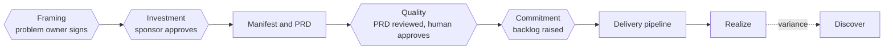

# Architecture: PM journey

This page lays out the pm group's journey the same way [Architecture: Role journey](Architecture-Role-Journey) does for the developer group: a single path from a raw business problem to a realized benefit, with the four human gates marked where they actually occur.

| Stage | Skills |
|-------|--------|
| Discover | [Discover](Skill-Discover) and [Map](Skill-Map), classifying the hat and grounding the problem |
| Framing | [Map](Skill-Map)'s Business Understanding Document, signed at the Framing gate |
| Define | [Carve](Skill-Carve) (product hat) or [TOM Architect](Skill-TOM-Architect) (transformation hat), plus [Case](Skill-Case) |
| Investment | [Case](Skill-Case)'s options and costing, approved alongside the manifest |
| Design and drafting | [PRD Draft](Skill-PRD-Draft), which drafts and then structurally validates each PRD, pressure-tested by [Grill](Skill-Grill) |
| Quality | [PRD Review](Skill-PRD-Review)'s 11-Star score, informing a human decision |
| Commitment | Handoff across the seam to the developer group's `slice` and `raise`, or straight to `impact` |
| Steady state | [Roadmap](Skill-Roadmap), [RAID](Skill-RAID), [Report](Skill-Report), [Realize](Skill-Realize) |

The four hexagons are not decoration; each marks a point where an agent's output stops and a named human's decision starts, the same discipline the developer ladder holds at its own four gates — see [GATES.md](https://github.com/tqnonline/skills/blob/main/skills/pm/GATES.md). `Realize`'s variance loop is what makes this a cycle rather than a straight line: a benefit that misses its projection re-enters `discover` or `carve` as new work, carrying its own case. For how a pm skill routes its own execution shape inside any one of these stages, see [Architecture: PM arrange](Architecture-PM-Arrange). For the substrate everything above is written against, see [Architecture: PM system](Architecture-PM-System).
