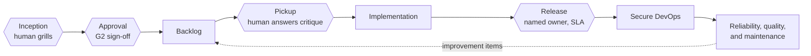

# Architecture: Role journey

Full documentation for every skill: https://tqnonline.github.io/skills/.

This page lays out every software-delivery role this repository covers, arranged as a single journey from an idea to a maintained system. The four human gates are marked where they actually occur in that journey.

| Stage | Skills |
|-------|--------|
| Inception | [Impact](Skill-Impact) (with [Recon](Skill-Recon) for brownfield work) and [Press](Skill-Press) for a branded PDF |
| Backlog | [Slice](Skill-Slice) and [Raise](Skill-Raise) |
| Design | [Architect](Skill-Architect), with [Responsible AI governance](Skill-Responsible-AI-Governance) applied where it is triggered |
| Implementation | [Conduct](Skill-Conduct) and [SDLC](Skill-SDLC) |
| Secure DevOps | [Safeguard](Skill-Safeguard), [Deliver](Skill-Deliver), and [Shakedown](Skill-Shakedown) |
| Reliability, maintainability, and application maintenance | [Operate](Skill-Operate), one post-release charter covering all three, whose findings return to the backlog as improvement items |

The four hexagons in the diagram are not a decoration; they mark a real point of control. At each one, the graph that `conduct` builds inserts a typed `human` node — a named owner, the exact decision to be made, and a service-level agreement — rather than a plain stop condition. For how that routing decision is made, see [Skill: Conduct](Skill-Conduct) and [Architecture: Loop vs graph](Architecture-Loop-vs-Graph).
