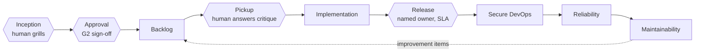

# Architecture: Role journey

Every SDLC role this repo covers, laid out as one journey from an idea to a maintained system — with the four human gates marked where they actually sit.

| Stage | Skills |
|-------|--------|
| Inception | [Impact](Skill-Impact) (+ [Recon](Skill-Recon) for brownfield), [Press](Skill-Press) for the branded PDF |
| Backlog | [Slice](Skill-Slice), [Raise](Skill-Raise) |
| Design | [Architect](Skill-Architect), [Responsible AI governance](Skill-Responsible-AI-Governance) where triggered |
| Implementation | [Orchestrate](Skill-Orchestrate), [SDLC](Skill-SDLC) |
| Secure DevOps | [Safeguard](Skill-Safeguard), [Deliver](Skill-Deliver), [Shakedown](Skill-Shakedown) |
| Reliability | [Operate](Skill-Operate) |
| Maintainability | [Assure](Skill-Assure) |
| Application maintenance | [Maintain](Skill-Maintain) — findings re-enter Backlog as improvement items |

The four hexagons are not decoration. Each is a point where the graph `orchestrate` builds inserts a typed `human` node — a named owner, the exact decision, and an SLA — rather than a bare stop condition. See [Skill: Orchestrate](Skill-Orchestrate) and [Architecture: Loop vs graph](Architecture-Loop-vs-Graph) for how that routing decision gets made.
